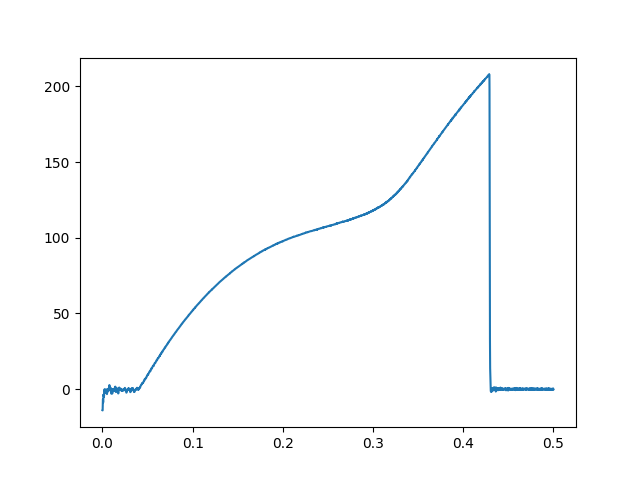

# graphene-stress-strain
lammps - simulation of a graphene sheet (with Tersoff potential) to extract stress-strain curve

### files:
* `generate_graphene.md` : how to generate graphene sheet with `VMD`
* `graphene.data` : file input for carbon atoms (generated with `VMD`)
* `graphene_relaxed.lmp` : simulation of the sheet and relaxation
* `graphene_stress_strain_deformed.lmp` : further apply deformation to generate required data for post processing
* `post-processing/stress-graph.py` : specific for this simulation to read the `log.lammps` and generate curve

(video captured with `VMD` with `DynamicBonds` and `VDW` representation)

<video src="media/simplescreenrecorder-2023-10-06_02.09.21.mp4" controls>
